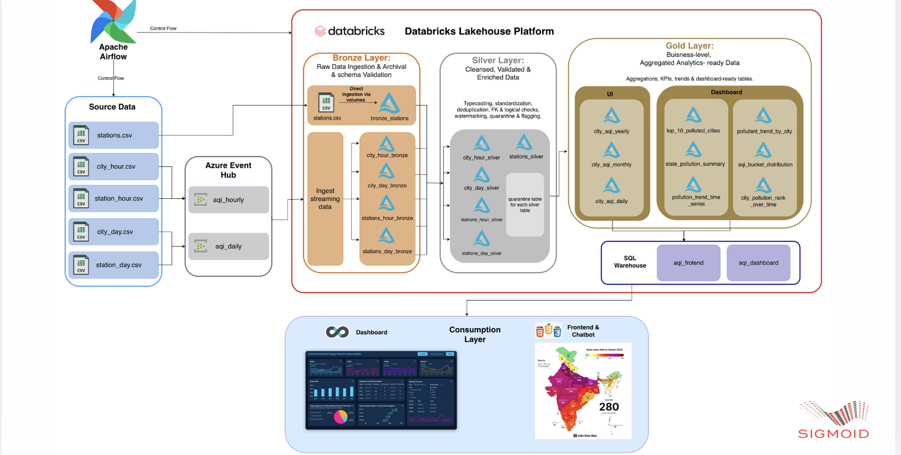
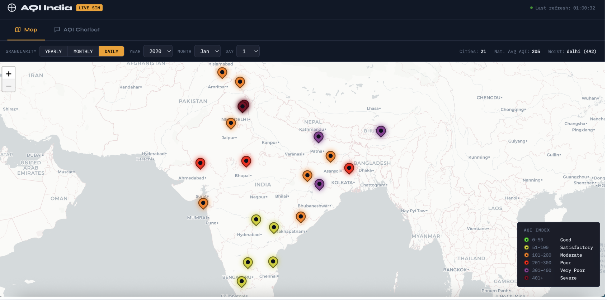
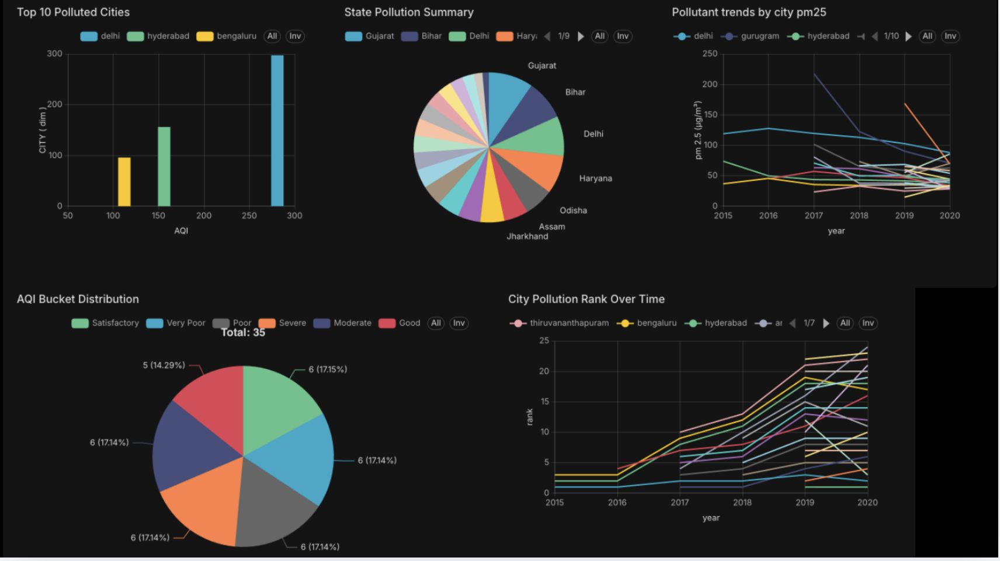

# 🌫️ Air Quality Monitoring System — India

A real-time, end-to-end data engineering pipeline for monitoring Air Quality Index (AQI) across Indian cities and stations — built on **Azure Event Hubs**, **Apache Kafka**, **Databricks (Delta Lake)**, **Apache Airflow**, and a **RAG-powered DE Assistant** using Claude AI.

---

## 📐 Architecture



> End-to-end pipeline: CSV sources → Azure Event Hubs (Kafka) → Databricks Lakehouse (Bronze / Silver / Gold) → SQL Warehouse → Dashboard & AQI Chatbot, orchestrated by Apache Airflow.

---

## 📸 Dashboard

### 🗺️ Live AQI Map — India


> Real-time city-level AQI map with daily/monthly/yearly granularity. Color-coded pins show AQI severity across 21+ Indian cities. National average AQI and worst city shown in the header.

---

### 📊 Analytics Dashboard


> Includes: Top 10 Polluted Cities bar chart, State Pollution Summary pie chart, PM2.5 pollutant trends by city (2015–2020), AQI Bucket Distribution, and City Pollution Rank Over Time.

---

## 🗂️ Project Structure

```
Air_Quality_Monitoring_system_India/
│
├── Producers/                          # Kafka producers for streaming data
│   ├── producer_city_day.py            # Daily city-level AQI producer
│   ├── producer_city_hour.py           # Hourly city-level AQI producer
│   ├── producer_station_day.py         # Daily station-level AQI producer
│   └── producer_station_hour.py        # Hourly station-level AQI producer
│
├── Medellian_Notebooks/                # Databricks (PySpark) notebooks
│   ├── Databricks_ingestion.ipynb      # Event Hub → Raw Volume ingestion
│   ├── bronze_layer.ipynb              # Raw → Bronze Delta tables
│   ├── silver_layer.py                 # Bronze → Silver (cleansed data)
│   ├── Gold_layer.ipynb                # Silver → Gold (AQI aggregates + geo)
│   └── Data_Quality_KPI_Report.ipynb  # Data quality checks & KPI reports
│
├── Airflow_Orchestration/
│   └── aqi.py                          # Airflow DAG: orchestrates full pipeline
│                                       # with schema validation & email alerts
│
└── rag-de-assistant-main/             # AI-powered assistant for the pipeline
    ├── app/
    │   ├── streamlit_app.py            # Streamlit chat UI (port 8501)
    │   ├── api.py                      # FastAPI REST backend (port 8502)
    │   ├── config.py                   # Centralised configuration
    │   └── auth.py                     # Token-based authentication
    ├── ingestion/
    │   ├── code_parser.py              # Python/SQL/YAML code indexer
    │   ├── docs_loader.py              # Markdown/text docs indexer
    │   ├── metadata_ingest.py          # Data catalog JSON indexer
    │   └── chunker.py                  # Smart text chunker
    ├── rag/
    │   ├── embeddings.py               # sentence-transformers wrapper
    │   ├── chroma_client.py            # ChromaDB client factory
    │   ├── retriever.py                # Vector search + MMR
    │   └── prompt_templates.py         # LLM prompt templates
    ├── agents/
    │   ├── pipeline_agent.py           # Main Q&A agent (Claude)
    │   ├── quality_agent.py            # Agentic data quality checker
    │   └── catalog_agent.py            # Catalog query agent
    ├── monitoring/
    │   ├── health_checker.py           # Pipeline health status
    │   ├── sla_tracker.py              # SLA adherence tracking
    │   └── failure_logs.py             # Failure log store
    ├── ingest_all.py                   # Bootstrap ChromaDB ingestion
    └── requirements.txt
```

---

## ⚙️ Tech Stack

| Layer | Technology |
|---|---|
| **Streaming** | Apache Kafka (via Azure Event Hubs) |
| **Processing** | Apache Spark (Databricks) |
| **Storage** | Delta Lake (Bronze / Silver / Gold) |
| **Orchestration** | Apache Airflow |
| **AI Assistant** | Claude API (Anthropic) |
| **Vector DB** | ChromaDB |
| **Embeddings** | sentence-transformers |
| **Backend API** | FastAPI |
| **Frontend UI** | Streamlit |
| **Cloud** | Azure (Event Hubs, Databricks) |

---

## 🔄 Pipeline Layers

### 🟫 Bronze Layer
Raw data ingested from Azure Event Hub volumes into Delta tables with schema enforcement. Handles all four data types: `city_day`, `city_hour`, `station_day`, and `station_hour`. Includes archive management and schema mismatch detection.

### 🥈 Silver Layer
Cleansed and validated data from Bronze. Applies deduplication, null handling, type casting, and standardised column naming. Output is query-ready Delta tables for downstream analytics.

### 🥇 Gold Layer
Final aggregated layer for consumption. Includes:
- **AQI bucketing** — Good / Satisfactory / Moderate / Poor / Very Poor / Severe
- **Geo-enriched city table** — latitude & longitude for all Indian cities (used in map dashboards)
- **Aggregated KPI metrics** — daily/hourly AQI trends by city and station

---

## 🚀 Getting Started

### Prerequisites

- Python 3.10+
- Databricks workspace (with Unity Catalog)
- Azure Event Hubs namespace
- Apache Airflow 2.x
- `confluent-kafka` Python client

---

### 1. Kafka Producers

Configure your Azure Event Hub credentials in each producer file under `Producers/`:

```python
conf = {
    'bootstrap.servers': '<your-eventhub-namespace>.servicebus.windows.net:9093',
    'security.protocol': 'SASL_SSL',
    'sasl.mechanism': 'PLAIN',
    'sasl.username': '$ConnectionString',
    'sasl.password': '<your-connection-string>',
}
```

Run a producer:

```bash
pip install confluent-kafka pandas numpy
python Producers/producer_city_day.py
```

---

### 2. Databricks Notebooks

Upload the notebooks from `Medellian_Notebooks/` to your Databricks workspace and run them in order:

```
1. Databricks_ingestion.ipynb   → Ingest from Event Hub volumes
2. bronze_layer.ipynb           → Raw → Bronze Delta
3. silver_layer.py              → Bronze → Silver Delta
4. Gold_layer.ipynb             → Silver → Gold Delta
5. Data_Quality_KPI_Report.ipynb→ Validate & report
```

Update the catalog name in each notebook:

```python
CATALOG = "<your-databricks-catalog>"
```

---

### 3. Airflow Orchestration

Copy `Airflow_Orchestration/aqi.py` to your Airflow DAGs folder.

Update the following constants at the top of the file:

```python
BASE_PATH  = "<your-databricks-notebook-base-path>"
CLUSTER_ID = "<your-databricks-cluster-id>"
CONN_ID    = "<your-databricks-airflow-connection-id>"
CATALOG    = "<your-unity-catalog-name>"
```

The DAG will:
- Trigger all Databricks notebook runs in sequence
- Validate schema warnings after each stage
- Send email alerts on failure with full traceback

---

### 4. RAG DE Assistant

```bash
cd rag-de-assistant-main

# Create and activate virtual environment
python -m venv .venv
source .venv/bin/activate        # Windows: .venv\Scripts\activate

# Install dependencies
pip install -r requirements.txt

# Configure environment
cp .env .env.local
# Add your ANTHROPIC_API_KEY to .env.local

# Run ingestion (indexes code, docs, and catalog into ChromaDB)
python ingest_all.py

# Start the FastAPI backend
uvicorn app.api:app --host 0.0.0.0 --port 8502 --reload

# Start the Streamlit UI (in a new terminal)
streamlit run app/streamlit_app.py
```

Open **http://localhost:8501** to chat with your pipeline assistant.

#### Example Questions
| Question | Mode |
|---|---|
| "Which cities have the worst AQI today?" | 💻 Code |
| "What pollutants are tracked in station_day?" | 🗂️ Catalog |
| "Are there any pipeline failures today?" | ❤️ Health |
| "What is the schema of the gold layer?" | 🗂️ Catalog |
| "Why did the silver layer job fail?" | ❤️ Health |

---

## 📊 Data Schema

### Pollutants Tracked

| Pollutant | Description |
|---|---|
| PM2.5 | Fine particulate matter |
| PM10 | Coarse particulate matter |
| NO | Nitric oxide |
| NO2 | Nitrogen dioxide |
| NOx | Nitrogen oxides |
| NH3 | Ammonia |
| SO2 | Sulphur dioxide |
| CO | Carbon monoxide |
| O3 | Ozone |
| Benzene | Benzene |
| Toluene | Toluene |
| AQI | Air Quality Index |

### AQI Buckets

| AQI Range | Category |
|---|---|
| 0 – 50 | 🟢 Good |
| 51 – 100 | 🟡 Satisfactory |
| 101 – 200 | 🟠 Moderate |
| 201 – 300 | 🔴 Poor |
| 301 – 400 | 🟣 Very Poor |
| 400+ | ⚫ Severe |

---

## 📬 Alerting

The Airflow pipeline sends **email alerts** on task failure with:
- Task name and logical date
- Databricks run page URL
- Full error message and traceback

Configure the recipient in `aqi.py`:
```python
send_email(to="your-email@example.com", ...)
```

---


## 👤 Author

**Shubham** — NIT Srinagar  
Built as a Capstone Project for Data Engineering
